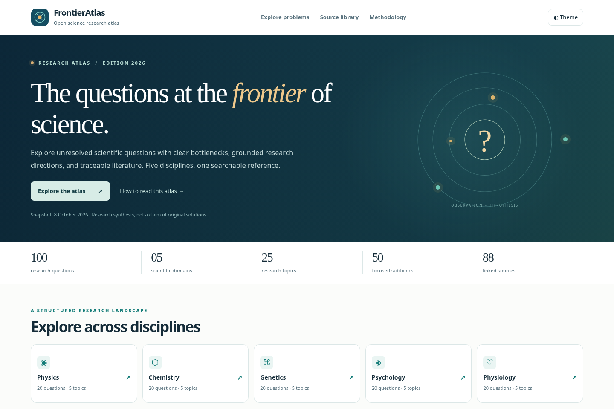

# FrontierAtlas

**An Evidence-Grounded Atlas of Open Scientific Problems**

*A curated, searchable catalog of 100 unresolved research questions across physics, chemistry, genetics, psychology, and physiology.*

[Explore the interactive atlas](docs/index.html) · [Read the full catalog](docs/RESEARCH_CATALOG.md) · [Browse the data](data/atlas.json) · [Research methodology](docs/METHODOLOGY.md)



## About

FrontierAtlas is a public research reference for locating unresolved scientific questions, understanding why they are challenging, and identifying experimentally or mathematically defensible next steps. It emphasizes careful problem formulation and traceable literature rather than speculative claims of solutions.

Each entry includes:

- A **precisely framed research question** and its classification.
- A short **scientific justification** explaining why the problem matters.
- The **primary theoretical, experimental, computational, or causal bottleneck**.
- A **proposed research direction** with a concrete first proof target or falsifiable milestone.
- **Direct links to relevant scholarly or authoritative sources**.

> **Scope and epistemic status:** “Open” includes formal mathematical conjectures, foundational empirical questions, and narrower active research challenges. These classes are not equivalent. Some problems have substantial partial solutions and may change status. An associated paper may establish the state of a field without directly proving that every formulation is unsolved. Proposed methods are research starting points, not validated discoveries.

## Coverage

| Domain | Research topics | Focused subtopics | Open questions |
|:--|--:|--:|--:|
| Physics | 5 | 10 | 20 |
| Chemistry | 5 | 10 | 20 |
| Genetics | 5 | 10 | 20 |
| Psychology | 5 | 10 | 20 |
| Physiology | 5 | 10 | 20 |
| **Total** | **25** | **50** | **100** |

The catalog contains **88 distinct reference records** associated with the questions. The reference collection is a selected reading list, not a systematic review or a guarantee that every live URL remains accessible.

### Taxonomy and exploration

The interactive site supports an explicit **domain → topic → subtopic** hierarchy; full-text search across problem titles, precise questions, justifications, bottlenecks, proposed research directions, milestones, and source titles; classification and research-approach filters; compact and card views; local favorites; and filtered exports in CSV, JSON, or Markdown.

The website runs without a backend, telemetry, third-party scripts, API credentials, or a JavaScript package manager. A self-contained HTML build works offline, and a public static edition is available in `docs/index.html`.

The browser search is **local to the public catalog**, with no remote search-indexing service or user-query collection. This public site does not handle confidential information. See [SECURITY.md](SECURITY.md) for publication and indexing boundaries.

## Interactive Research Explorer

The [interactive atlas](docs/index.html) is a self-contained public research explorer. It supports full-text search, cascading domain/topic/subtopic filters, bookmarks stored locally in the browser, light and dark themes, references, and filtered catalog exports. The [standalone HTML edition](FrontierAtlas_Interactive.html) is also available for offline exploration.

The web edition and offline file use the same curated dataset. No backend, accounts, API keys, search vendor, analytics, or external JavaScript are needed.

## Repository map

```text
frontier-atlas/
├── README.md                          Independent research project overview
├── FrontierAtlas_Interactive.html     Single-file, offline-capable website
├── data/
│   ├── atlas.json                     Canonical dataset with 100 problems and sources
│   ├── problems.csv                   Tabular question catalog
│   └── references.csv                 Deduplicated reference index
├── src/
│   ├── index.template.html            Semantic HTML template
│   ├── style.css                      Responsive visual design
│   └── app.js                         Search, faceting, bookmarks and export
├── docs/
│   ├── index.html                     Interactive web explorer
│   ├── RESEARCH_CATALOG.md            Full readable entries, with citations
│   ├── METHODOLOGY.md                 Evidence and classification policies
│   └── RESEARCH_ROADMAP.md            Reproducible research starting points
├── assets/                             Website preview and public social-media artwork
├── scripts/                            Dependency-free build/export/validation tools
├── tests/                              Automated integrity tests
├── .github/workflows/                  Automated catalog validation and web release
├── CITATION.cff                        Citation metadata
├── LICENSE                             MIT software license
├── LICENSE-CONTENT.md                  CC BY 4.0 content license information
└── SECURITY.md                         Public indexing, browser, and release security policy
```

## Data model

`data/atlas.json` has these top-level collections:

| Key | Description |
|:--|:--|
| `metadata` | Snapshot date, version and editorial status |
| `problems` | 100 annotated problem objects |
| `sources` | 88 keyed bibliographic source records |
| `refnum` | Stable display numbers for those source keys |
| `intro` | Editorial caveats and domain-status notes |
| `vignettes` | Five illustrative mathematical starting points |
| `shortlist` | Selected research starting points |

A problem uses a stable identifier (`P01`, `C04`, `G06`, `PS17`, `PH20`) and fields for `domain`, `topic`, `subtopic`, `title`, `question`, `justification`, `bottleneck`, `direction`, `first_test`, `status`, `route`, and `refs`. The `refs` list contains keys into `sources`, not copied bibliographic strings.

The [editorial methodology](docs/METHODOLOGY.md) distinguishes references that support the *problem context* from evidence establishing the novelty or correctness of a *proposed research direction*.

## Responsible scientific use

FrontierAtlas is a hypothesis-generation and literature-navigation aid, not a source of automatically verified proofs or treatment advice. Before citing an item in a publication or proposal, inspect its primary sources, verify its current research status, and check the assumptions behind its proposed first test. Human-subject and biomedical research requires appropriate ethics review, participant protections, and data governance.

**Dated status note:** The September 2026 claim concerning forced Navier–Stokes breakdown was described as apparently settling a version of the Clay problem, while evaluation remained outstanding at this snapshot. The separate unforced regularity problem is not treated as resolved by that claim. See entries `P02` and references `R2–R3`.

## Scientific Corrections and Evidence Updates

The catalog is a dated research snapshot, not a fixed list of permanently unsolved questions. New proofs, experiments, replications, or source corrections may change an entry's status. Research claims should be assessed using the [evidence standards](docs/METHODOLOGY.md) and the original cited publications.

## Acknowledgments and AI assistance

**OpenAI GPT-6 (via ChatGPT)** was used to assist with literature-oriented synthesis, initial organization of the research questions, explanatory text, research-direction brainstorming, and preparation of the repository and interactive interface. AI-generated material can contain errors. The resulting entries, citations, and proposed methods should be independently verified by domain experts. Neither OpenAI nor the model is represented as the author of a proven scientific result, a referee, or an endorser of this project.

The atlas also draws on the work of the researchers and institutions identified in its linked reference index; original scientific credit belongs to those authors.

## Citation

See [`CITATION.cff`](CITATION.cff). Until a versioned archival identifier is issued, cite this repository with its version, date and repository URL. Cite the underlying scientific sources directly when discussing particular claims.

## Licensing

Source code is available under the [MIT License](LICENSE). Original editorial text and structured catalog content are available under [Creative Commons Attribution 4.0 International](LICENSE-CONTENT.md). Linked third-party articles, publisher materials, journal graphics and external websites retain their original copyright and licenses.
